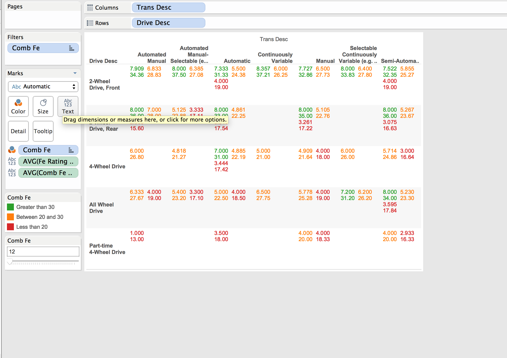

Name: Ke Chen, Abhinav Bannerjee

UT EID: kc35827, ab45393

```{r,message=FALSE,echo=FALSE}
source("../.Rprofile",echo=FALSE)
```
###General Steps
1. Find the .csv data 
2. create the repository in Github.
3 create project with four directories.
4. Using R_etl.r to reformat our datas and import data into ORACL SQL.
5. Query datas from server, and create Tableau workbook.
6. make three different grpah by using graph.
7. make explanation on each plot.
8. Knit R, combine all file into a html file.

New things add,
--------------------------------------------------------
1. We create a new dataset which can be blended by old data set.
2. We create new barchart in Tableau after blend.
3. We reproduce plots which we created last time.


###R_ETL.R file operation
The R_ETL file generates a code for us to create a table in Oracle SQL.
```{r,message=FALSE,echo=FALSE,warning=FALSE}
source("../01 Data/1.R",print.eval=FALSE)
```
```{r,echo=FALSE,message=FALSE,warning=FALSE}
source("../01 Data/Dataframe.R", echo=FALSE)
```

###Blended Data
 
We create a dataset by ourselves. By adding countries from for each division.


###visualization

####Scatter Plot
 
This visualization shows the most efficient vehicles based on mileage and annual fuel costs incurred on the driver. Naturally, economy class cars tend to be more efficient and cost effective(cost less).
Here is the plot produced by Rstudio.
```{r,message= FALSE,echo=FALSE,warning=FALSE,fig.width=16,fig.height=12}
source("../03 R SQL Visualization/plot1.R",print.eval=TRUE,echo = TRUE)
```

 #### Crosstab


This visualization displays the most efficient cars and segments car models based on transmission and drive type. Front 2-wheel driven cars seem to be most efficient, regardless transmission type.
Here is the plot produced by Rstudio.
```{r,message= FALSE,echo=FALSE,warning=FALSE,fig.width=15,fig.height=12}
source("../03 R SQL Visualization/plot2.R",print.eval=TRUE,echo = TRUE)
```


#### Bar Chart
 

This visualization breaks down cars by manufacturer and make. It then proceeds to aggregate fuel efficiency ratings for each car (and distinguishes between transmission types). Sports vehicles are clearly below the median mileage here. The reference line stands for the median Combinantion Fuel. And we can see clearly which carline are below the median, and which are above the median. 

Here is the plot produced by Rstudio.
Because we have too much carlines, and Rstudio cannot show them in one image, we tried to remove the carline, and keep only division and transmission type in the plot.
```{r,message= FALSE,echo=FALSE,warning=FALSE,fig.width=25,fig.height=20}
source("../03 R SQL Visualization/plot3.R",print.eval = TRUE,echo = TRUE)
```

####New Bar Chart
 
We have country and division in x axis, and median comb fe guide in y axis. We put fe rating as color. We can see which country produce more efficient cars.


